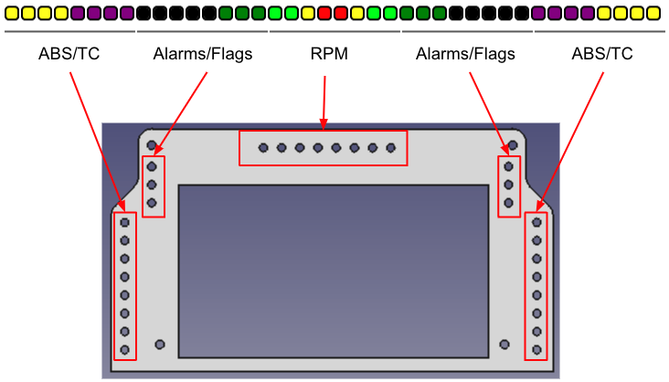
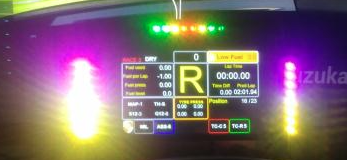
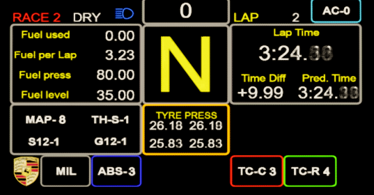
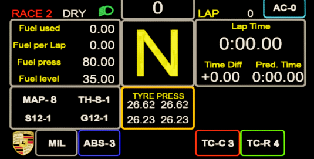
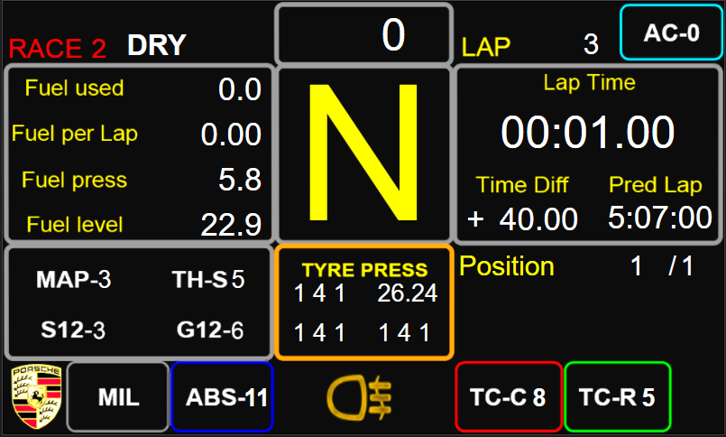
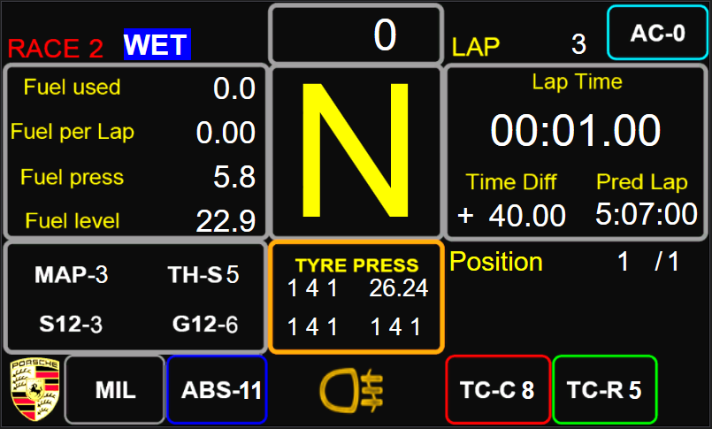
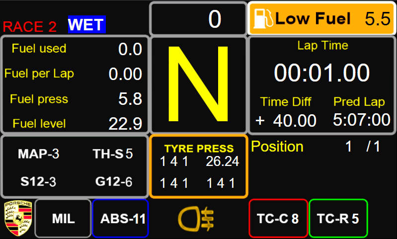

# DIY Porsche Dashboard

## Simhub LED profile





This Simhub LED profile is designed for 5 x 8 led `WS2812B` strips.
The 40 combined led are split in 3 groups:

* ABS / TC / Spotter
* Alarms / Flags
* Shift light

### Effects

#### Turn indicators

LED `16` & `25` indicates left and right turn signals when on.

#### Flags

Alarms/flags LED ([`14`, `15`, `16`] & [`25`, `26`, `28`]) indicates green, white, blue and
yellow flags.

#### Low fuel

LED `16` & `25` indicates (red blinking) low fuel (when fuel is lower than 10L).

#### Shift light

the LED `17` to `25` are used for RPM display. LED `17` to `21` are mirrored to mimic
the Porsche 991 GT3R II shift light (from green to red with yellow center led
and on 8 led rather than 10) and blink blue when redline is reached.

These LED are also used to indicate when PIT limiter is on (by blinking blue).

#### ABS, TC and Spotter

The first and last 8 led are used for ABS, TC and spotter as such:

The lower 4 (on both side) led illuminate yellow to indicate ABS is active.
The upper 4 (on both side) led illuminate red to indicate TC is active.
The all 8 led blink red when a car is on the left or right (8 led on the left / 
8 led on the right).

#### Hidden led

The first covered led of the `Alarm/flags` strip on the right (led #28) is
illuminated orange when rain light is on.

The first covered led of the `Alarm/flags` strip on the left (led #13) is
illuminated green when Low Beam is on and illuminated blue when High Beam is on.

## Porsche Dashboard

The Porsche dashboard is based on [the work from Erik_27](https://www.racedepartment.com/downloads/porsche-911-gt3-r-dashboard.43175/) (Discord: Erik_27#4832).

The dashboard is composed of 4 screens:

- `Idle` (The loading screen with the Porsche logo)
- `RACE 1`
- `QUALI`
- `RACE 2`

(they're actually sorted in this order: [`RACE 1`, `QUALI`, `RACE 2`])

### High Beam



### Low Beam



### Rain Light



### Wet Tyres On



### Low Fuel



> **NOTE**
> As per the `Low Fuel` leds, the `Low Fuel` panel of the dashboard is displayed when the fuel level is lower than 10L.
> 
> Visible binding:
> ```
> [Fuel]<10
> ```

> **NOTE**
> Both `Wet Tyres` and `Low Fuel` was implemented in the original dashboard from Erik_27. But they've been modified here to work correctly with ACC.

### Position

As visible in the screenshots above, the current position has been added to the screen `RACE 2`.